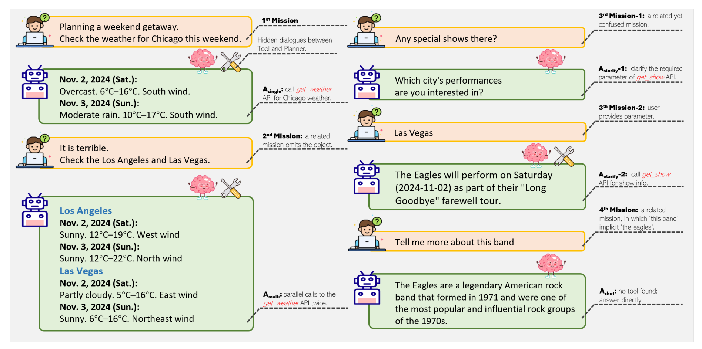
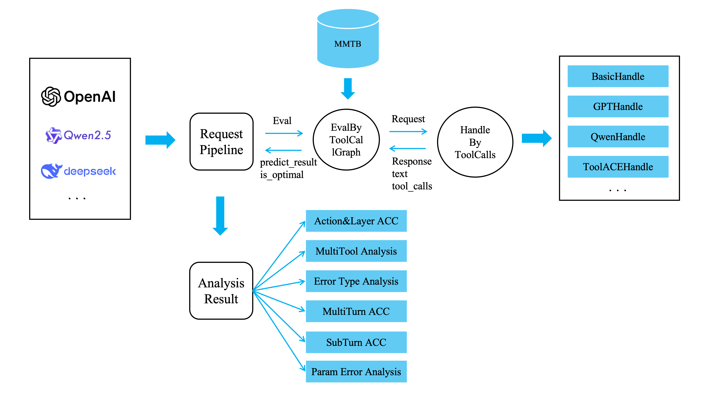
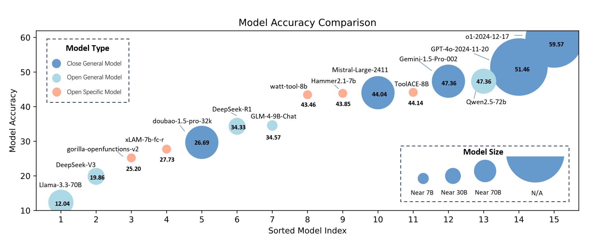
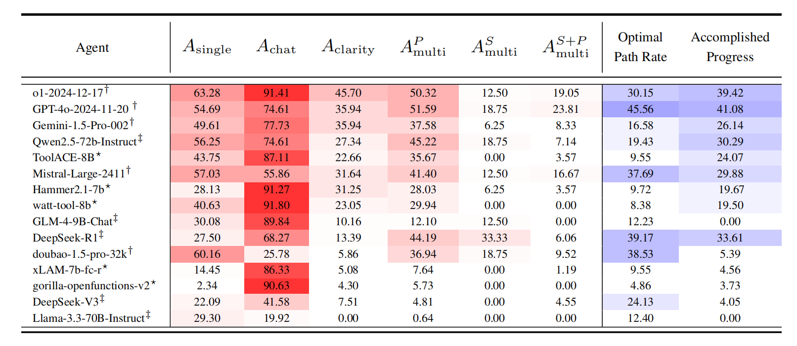
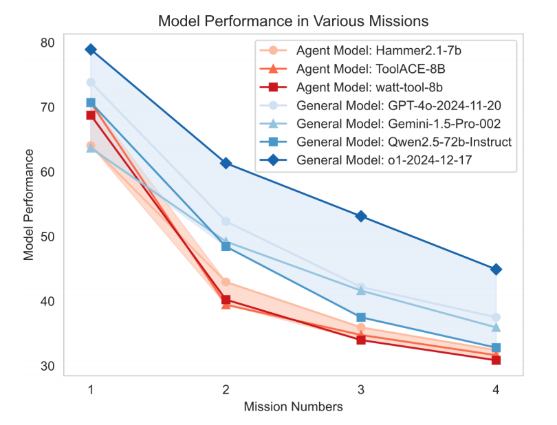
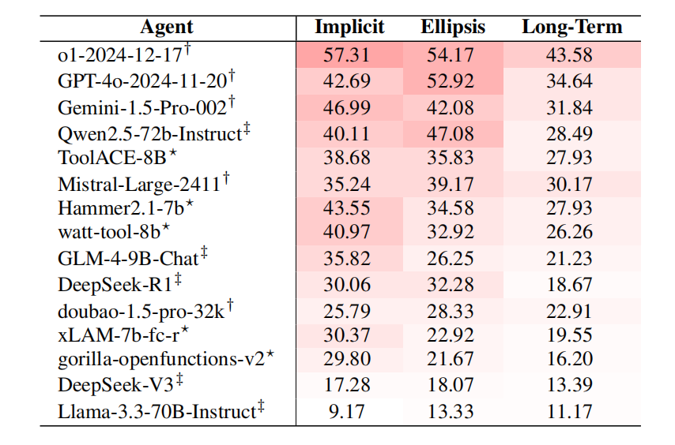

# Multi-Mission Tool Bench: Assessing the Robustness of LLM based Agents through Related and Dynamic Missions


<p align="center">
    <a>English</a> •
    <a href="README_ZH.md">中文</a>
</p>





## 📖 Overview
This is an evaluation tool for the paper: Multi-Mission Tool Bench: Assessing the Robustness of LLM based Agents through Related and Dynamic Missions, which can also use the multi-agent data generation framework proposed in the paper to synthesize multi-task data for Agents.

Large language models (LLMs) demonstrate strong potential as agents for tool invocation due to their advanced comprehension and planning capabilities. 
Users increasingly rely on LLM-based agents to solve complex missions through iterative interactions.
However, existing benchmarks predominantly access agents in single-mission scenarios, failing to capture real-world complexity. To bridge this gap, we propose the Multi-Mission Tool Bench. In the benchmark, each test case comprises multiple interrelated missions. This design requires agents to dynamically adapt to evolving demands. Moreover, the proposed benchmark explores all possible mission-switching patterns within a fixed mission number. Specifically, we propose a multi-agent data generation framework to construct the benchmark. We also propose a novel method to evaluate the accuracy and efficiency of agent decisions with dynamic decision trees. Experiments on diverse open-source and closed-source LLMs reveal critical factors influencing agent robustness and provide actionable insights to the tool invocation society.


## 🚀 News

- **[2025.03.30]** 🎉 We have released the test data and evaluation code for the Multi-Mission Tool Bench.
- **[2025.03.18]** 🏅️ Our team achieved the first place in China and the second place in the world in the Agent category in the [March 2025 SuperClue Chinese Large Model Benchmark Evaluation](https://mp.weixin.qq.com/s/Nv0YozaCX4cmeiroyq7YEg), outperforming DeepSeek, Qianwen, and Doubao by more than 5 points, 10 points, and 15 points, respectively.


## ⚡️ Quickstart

### Basic Installation

```bash
# Create a new Conda environment with Python 3.10
conda create -n MMTB python=3.10
conda activate MMTB

# Clone the MMTB repository
git clone https://github.com/yupeijei1997/MMTB.git

# Change directory to the `mmtb`
cd mmtb/

# Install the package
pip install -r requirements.txt
```

## ⏳ Inference

### 💾 Test Data
Address: mmtb/data/Multi-Mission-Tool-Bench.jsonl

Description: Our test data has undergone five rounds of manual inspection and correction by six senior algorithm engineers with years of experience in NLP, CV, and LLM, taking about one month in total. It boasts extremely high quality and accuracy, with a tight connection between multiple rounds of tasks, increasing difficulty, no unusable invalid data, and complete consistency with human distribution. Its evaluation results and conclusions are of great reference value for subsequent optimization in the Agent direction.

Specifically, the data quality optimization work went through the following stages:

1. The initial data was generated using our proposed Multi Agent Data Generation framework, covering all possible action spaces.

2. The test data was then divided according to four different types of actions defined by us and manually inspected and corrected by four different algorithm engineers. Specifically, since tasks generated by LLM are always too formal and not colloquial enough, especially after the second task, it is difficult to generate true multi-turn tasks. Therefore, we conducted the first round of corrections based on the criteria of colloquialism and true multi-turn tasks. Notably, in designing the third and fourth round tasks, we added tasks with long-term memory, a true multi-turn type, to increase the difficulty of the test set.

Note: In the actual construction process, the four algorithm engineers adopted a layer-by-layer approach, first generating a layer of data with the model, then manually inspecting and correcting it, before generating and correcting the next layer of data. This approach avoids the difficulty of ensuring overall correctness and maintaining data coherence when, after generating all layers of data at once, a problem in one layer requires corrections that often affect both the previous and subsequent layers. Thus, our layer-by-layer construction ensures strong logical consistency and close relationships between layers, without any unreasonable trajectories.

3. After the first round of corrections by the four algorithm engineers, two senior experts in the Agent field would comment on each piece of data, indicating whether it meets the requirements and what problems exist, followed by a second correction by the four algorithm engineers.

4. After the second round of corrections, we introduced cross-validation, where the four algorithm engineers inspected and commented on each other's data. Then, the four algorithm engineers and two senior experts in the Agent field discussed and made a third round of corrections on the doubtful data.

5. After the third round of corrections, the two senior experts in the Agent field separately conducted a fourth round of inspection and correction on all data to ensure absolute accuracy.

6. Finally, since human corrections might introduce errors, we used code to check for possible parameter type errors and unreasonable dependencies caused by manual operations, with two senior experts making the final fifth round of corrections.

Through these five stages of data quality optimization, each piece of data was manually corrected and constructed by multiple algorithm experts, improving our test data's accuracy from less than 60% initially to 100% correctness. The combination of model generation and multiple human corrections also endowed our data with excellent diversity and quality. Moreover, since our data covers all possible action spaces, it is very balanced, capable of thoroughly testing the model's weaknesses.

Ultimately, this high-quality data set we constructed laid the foundation for our subsequent experiments, lending absolute credibility to our conclusions.

Additionally, we provide bilingual support for the test data, including both English and Chinese versions, all of which have undergone the aforementioned manual inspection process. Subsequent LeadBoard results will primarily report the English version.

## 🛠️ Framework

Our evaluation framework is constructed in a manner that separates inference and results analysis, offering several advantages as follows:

- High reproducibility: In our test data, the execution results of all tools corresponding to the golden answers have been persistently saved. There is no need for any website's KEY, and there are no unstable tool invocation scenarios, ensuring the reproducibility of the results.
- High evaluation efficiency: Our evaluation is conducted dynamically. The first phase is carried out using EvalByToolCallGraph module, deciding whether to continue calling based on whether the action (predicted tool name) matches the golden answer. Meanwhile, decision tree pruning is used during the process, significantly reducing the number of maintenance paths and speeding up the evaluation.
- High code reusability: All our requests use the standard ToolCalls protocol, making our evaluation code highly reusable. Additionally, we have encapsulated the ToolCalls protocol for several open-source general models and open-source specialized models that did not support the ToolCalls protocol, making the code logic clearer and solving the problem of other evaluation frameworks mixing Prompt and ToolCalls invocation methods, leading to confused logic.
- Multiple evaluation analysis dimensions: After obtaining the prediction and action-level evaluation results from the first phase, we use the AnalysisResult module to conduct a detailed evaluation of its results, including analyses across six dimensions. To our knowledge, among all Agent evaluation frameworks, we offer the most analysis dimensions and the most detailed results. Also, our results are saved in CSV files, facilitating developers in bad case analysis.
- Strong scalability: Since we use the standard ToolCalls protocol, for API models, GPTHandle can be used for rapid integration; for new open-source models, we will continue to update this repository for integration; for developers' own trained models, they can refer to our Handle code to encapsulate the Prompt calling method into the ToolCalls protocol for rapid integration and verification.

The overall framework diagram is as follows:




### 🤖 API Models
This project supports multiple API models, including: GPT-4o, GPT-o1, Gemini-1.5, Claude-3.5, Claude-3.7, Mistral-Large, etc.

Taking GPT-4o as an example, set the following key in the environment variables

```bash
export OPENAI_MODEL=xxxxxxxxx
export OPENAI_API_KEY=xxxxxxxxx
export OPENAI_BASE_URL=xxxxxxxxx
```

If using AZURE, set the following key:

```bash
export AZURE_OPENAI_DEPLOYMENT=xxxxxxxxx
export AZURE_OPENAI_ENDPOINT=xxxxxxxxx
export AZURE_OPENAI_API_KEY=xxxxxxxxx
export AZURE_OPENAI_API_VERSION=xxxxxxxxx
```

Afterwards, use the following code to request model results, setting the model to gpt4o. If the test is unexpectedly interrupted midway, you can modify the continue_file to continue the test. This will ensure that the already predicted results will not be predicted again.

```bash
cd mmtb/bench_test

python3 request_pipeline.py \
    --model=gpt4o \
    --data_path=./data/Multi-Mission-Tool-Bench.jsonl \
    --output_path=./result \
    --language=en \
    --continue_file=empty.jsonl \
    --remove_role=True \
    --contain_context=True
```

### 🤗 HuggingFace Models

This project also supports a variety of open-source specialized models and open-source general models, as follows:

Open-source specialized models include: watt-tool series, ToolACE-8B, Hammer2.1 series, xLAM-7b-fc-r-7b, gorilla-openfunctions-v2.

Open-source general models include: Llama-3.3 series, Qwen2.5 series, GLM-4-9B-Chat, DeepSeek-R1, DeepSeek-V3.

For example, with Qwen2.5-7B-Instruct, you can refer to the [Qwen function call documentation](https://qwen.readthedocs.io/en/latest/framework/function_call.html) to deploy the Qwen model first.

Afterward, use the following code to request the model results, set the model to qwen7b, and set the model_url to the IP and port number of your deployment machine, for example: http://111.111.111.111:12345. If the test stops unexpectedly, you can modify the continue_file to continue testing.

```bash
python3 request_pipeline.py \
    --model=qwen7b \
    --data_path=./data/Multi-Mission-Tool-Bench.jsonl \
    --output_path=./result \
    --language=en \
    --model_url=MODEL_URL \
    --continue_file=empty.jsonl \
    --remove_role=True \
    --contain_context=True
```

Finally, in mmtb/bench_test/handle/handles.py, we have enumerated the 10 types of Handles that we have implemented. If you want to test other models, you can refer to this file to get the settings for the model parameters. Additionally, if you want to add your own implemented Handle, you can also do so in this file.

## 💫 Evaluation

Use the following code to evaluate the model's prediction results. Fill in PREDICT_DATA_FILE with the corresponding prediction file from the previous step's ./result directory. The evaluation results include: matrix accuracy for action type and layer, individual accuracy for action type and layer, multi-tool invocation result analysis, error type analysis, true/false multi-turn accuracy, true multi-turn subtype accuracy, and parameter error type analysis.

Detailed results will be output to data_with_details.csv.

```bash
cd mmtb/bench_test

python3 analysis_result.py \
    --data_file PREDICT_DATA_FILE \
    --output_csv_flag=True \
    --output_csv_path=./data_with_details.csv
```

In particular, we have persistently saved the results of all models reported in the paper in the mmtb/bench_test/result directory, making it convenient for everyone to directly reproduce the results presented in the paper. This facilitates people developing Agent models to analyze bad cases, and provides a convenient way for people who want to quickly learn evaluation code, without the need to perform inference again.

Below is an example of how to reproduce the results of GPT-o1.

```bash
python3 analysis_result.py \
    --data_file ./result/2025-02-11-11:45:51_a5be8b_gpt4o1_en_remove_role_contain_context.jsonl \
    --output_csv_flag=True \
    --output_csv_path=./data_with_details.csv
```

Additionally, we have also supported the evaluation of prediction results from multiple models at the same time, which further enhances usability.

Below is an example of simultaneously reproducing the results of GPT-o1 and GPT-4o, with multiple files concatenated using a comma.

```bash
python3 analysis_result.py \
    --data_file ./result/2025-02-11-11:45:51_a5be8b_gpt4o1_en_remove_role_contain_context.jsonl,./result/2025-02-11-14:40:24_5ef3f9_gpt4o1120_en_remove_role_contain_context.jsonl \
    --output_csv_flag=True \
    --output_csv_path=./data_with_details.csv
```

## 📊 LeadBoard

### General Leaderboard



- OpenAI's GPT-o1 and GPT-4o models rank first and second, respectively, while the strongest model in the Qwen2.5 series, 72b, ranks third. This indicates that OpenAI's models still hold a leading position in the Agent field, but domestic models are gradually closing the gap.
- Some of the latest specialized small models for Agents, such as ToolACE-8B, Hammer2.1-7b, and watt-tool-8b, have all shown capabilities that can rival those of general-purpose large models. This suggests that specialized models fine-tuned for specific domains still hold great value. However, some older specialized models, such as xLAM-7b-fc-r and gorilla-openfunctions-v2, performed poorly, indicating that the industry as a whole is making rapid progress in the Agent field.
- Some general models that lead in areas such as mathematics and reasoning, such as DeepSeek-R1, DeepSeek-V3, and doubao1.5-pro-32k, although ahead in mathematical reasoning, are lagging in the Agent field and need further improvement.

### Sub-Leaderboard1 - Different types of actions



- The performance of various models under multi-tool action types is generally poor, especially when it comes to multi-tool invocation - serial and multi-tool invocation - serial-parallel types. Compared to the multi-tool invocation - parallel type, the performance further declines. This indicates that when tasks involve complex planning abilities, it remains a significant challenge for large language models.
- The performance of various models under clarification action types is also generally poor, with the highest score not reaching 50 points. This suggests that the models struggle to accurately capture the required tool parameter information missing from user tasks, which can lead to parameter hallucination phenomena, resulting in tool invocation outcomes that do not meet expectations.
- Individual models, such as Mistral and doubao, show a significant decline in performance under the chat type, while their performance in single-tool invocation is quite good. This indicates that these models may have focused too much on positive examples that require tool invocation during training, while neglecting the construction of negative cases, leading to a severe function hallucination phenomenon. This may prevent them from being used in actual production.

### Sub-Leaderboard2 - Different number of tasks



- The accuracy of each model significantly decreased from the second round onwards, and from the second round, all tasks were true multi-turn tasks, which could not be completed solely based on the information from that current round and required reliance on context for resolution. This greatly increased the difficulty of the tasks and was a real test of the models' ability to understand context. The results show that none of the models were able to handle true multi-turn tasks well, indicating that their ability to understand context needs to be strengthened.
- The decline in performance was greater for the open-source specialized models, suggesting that the general models have a better overall ability to understand context compared to the open-source specialized models. This may be because the general models were trained with more diverse true multi-turn data, which to some extent enhanced their ability to understand true multi-turn interactions in Agent scenarios.

### Sub-Leaderboard3 - Different Types of True Multi-Wheelers



- All models show poor accuracy for the true multi-turn three subtypes, with even the strongest GPT-o1 model only achieving 40-50% accuracy. This further explains why, starting from the second round, the accuracy of each model begins to drop sharply.
- In particular, among the three subtypes, the effect on long-term memory is the worst, and long-term memory only appears in the third and fourth rounds of tasks (when it appears in the third round, it tests the model's ability to remember information from the first round. When it appears in the fourth round, it tests the model's ability to remember information from both the first and second rounds, which is more challenging). This also explains why there is a further decline in accuracy during the third and fourth rounds compared to the second round.

## 🗺️ Roadmap

In the near future, we plan to release the following content:

   - [x] Release Multi-Mission Tool Bench test data
   - [x] Release Multi-Mission Tool Bench evaluation code
   - [ ] Release multi-agent generation framework code
   - [ ] Launch LeadBoard Website and provide ongoing updates
   - [ ] Publish the paper Multi-Mission Tool Bench: Assessing the Robustness of LLM based Agents through Related and Dynamic Missions
