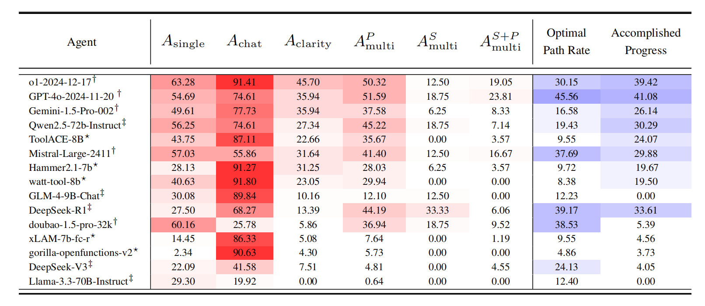
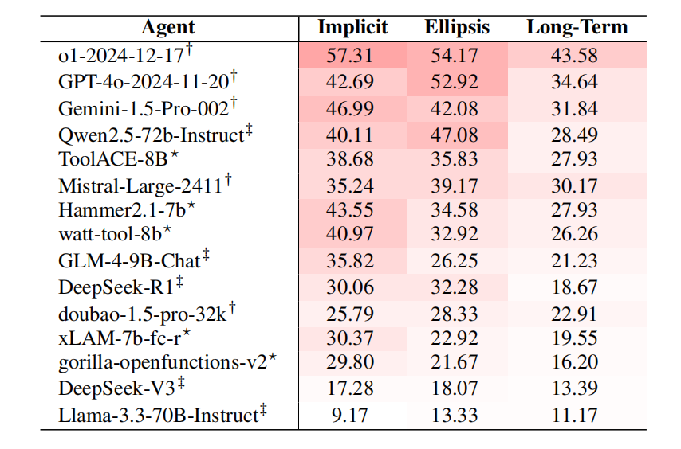
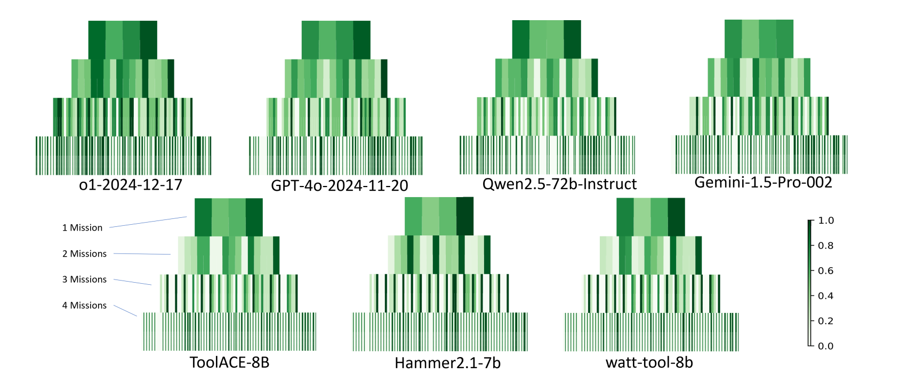

# Multi-Mission Tool Bench: Assessing the Robustness of LLM based Agents through Related and Dynamic Missions


<p align="center">
    <a href="README.md">English</a> •
    <a>中文</a>
</p>


## 📖 Overview
这是针对论文：Multi-Mission Tool Bench: Assessing the Robustness of LLM based Agents through Related and Dynamic Missions 的评估工具，同时可使用论文里提出的多智能体数据生成框架来合成Agent的多任务数据。

大型语言模型（LLM）凭借其先进的理解能力和规划能力，在作为工具调用的智能体方面展现出了巨大的潜力。用户越来越依赖基于大型语言模型的智能体，通过迭代交互来解决复杂任务。
然而，现有的基准测试主要是在单任务场景中评估智能体，无法体现现实世界的复杂性。为了填补这一空白，我们提出了 Multi-Mission Tool Bench 测试。在这个基准测试中，每个测试用例都包含多个相互关联的任务。这种设计要求智能体能够动态适应不断变化的需求。此外，所提出的基准测试探索了在固定任务数量下所有可能的任务切换模式。具体而言，我们提出了一个多智能体数据生成框架来构建这个基准测试。我们还提出了一种利用动态决策树来评估智能体决策准确性和效率的新方法。在各种开源和闭源大型语言模型上进行的实验揭示了影响智能体稳健性的关键因素，并为工具调用领域提供了可行的见解。


## 🚀 News

- **[2025.04.02]** 🎆 我们发布了 Controllable Multi Agent Data Generation 的代码。
- **[2025.03.30]** 🎉 我们发布了 Multi-Mission Tool Bench 的测试数据和评估代码。
- **[2025.03.18]** 🏅️ 我们团队在 [2025年3月SuperClue中文大模型基准测评](https://mp.weixin.qq.com/s/Nv0YozaCX4cmeiroyq7YEg) 中拿下了Agent方向国内第一名、世界第二名的好成绩，比DeepSeek、千问、豆包领先分数分别高达5分、10分、15分以上。


## ⚡️ Quickstart

### Basic Installation
```bash
# Create a new Conda environment with Python 3.10
conda create -n MMTB python=3.10
conda activate MMTB

# Clone the MMTB repository
git clone https://github.com/yupeijei1997/MMTB.git

# Change directory to the `mmtb`
cd mmtb/

# Install the package
pip install -r requirements.txt
```

## ⏳ Inference

### 💾 Test Data


地址：mmtb/data/Multi-Mission-Tool-Bench.jsonl

说明：我们的测试数据经过了了五名从业NLP、CV、LLM方向多年的高级算法研究员五轮的人工查验与修正，总耗时约1个月。具有极高的质量和准确率，多轮任务之间具有紧密的联系，难度依次递增，不存在不可用的无效数据，并且与人类分布完全一致，其评测结果与结论对后续Agent方向的优化有着极高地参考价值。

具体来说，经过了如下几个阶段的数据质量优化工作：

1、初始数据是使用我们提出的Multi Agent Data Generation框架生成的，并且覆盖了所有可能的动作空间。

2、之后将测试数据按照我们的定义的四种不同类型的动作进行划分，并交由不同的四名算法研究员进行人工查验与修正。具体地，由于LLM生成的任务总是过于正式，不够口语化，特别是到了第二个任务之后，难以生成真多轮问题。因此，我们基于口语化、必须为真多轮任务两个准则对数据进行第一轮修正。特别的，在设计第三轮和第四轮任务时，我们会增加长期记忆这一真多轮类型的任务，来增加测试集的难度。

注：特别的，在实际构建过程中，四名算法研究员均采用了一层一层的方式构建，先由模型生成一层的数据，之后交由人工查验与修正，之后再进行下一层的数据生成与修正。这样做的好处是，避免了在一次性生成所有层的数据之后，当某一层的数据存在问题需要修正时，往往需要对其前一层和后几层的任务均修改，才能保证整体正确性，这会使得数据构建困难，并难以保证数据整体的连贯性。因此，我们采用逐层构建的方式，使得我们的数据层与层之间的任务逻辑性强，关系紧密，不存在不合理的轨迹。

3、在四名算法研究员进行了第一轮修正之后，会由一名Agent领域的高级专家对每条数据进行点评，说明其是否符合要求以及存在的问题，之后由这四名算法研究员进行二次修正。

4、在第二轮修正之后，我们引入了交叉验证，四名算法工程分别去查验其他人的数据并进行点评，然后四名算法研究员和一位Agent领域的高级专家进行讨论，对存疑的数据进行第三轮的修正。

5、在第三轮修正之后，会由一名Agent领域的高级专家分别对全部数据进行第四轮查验与修正，确保数据的绝对准确。

6、最后，由于人类修正可能存在误操作，我们会使用代码对可能误操作产生的参数类型错误、不合理依赖关系进行检查，并由一位高级专家进行最终第五轮的修正。

经过上述五个阶段的数据质量优化工作，每一条数据均由多个算法专家人工修正与构建，使得我们的测试数据从最初的准确率不到60%，最终达到了100%的正确性，并且模型生成结合多人修正的方式，也让我们的数据具备极佳的多样性和质量。

同时，相比其他BenchMark，如BFCL、T-EVAL等，我们的数据覆盖了所有可能的动作空间，并且在第二至四轮全部是真多轮任务，覆盖率达到了2个100%，这也让我们的数据分布十分均衡，能够无死角的测试出模型的短板所在。


最终，我们构建的这份高质量数据，为我们后续的实验奠定了基础，让我们的结论具有绝对的可信度。

此外，我们为测试数据提供了双语支持，包括英文和中文两个版本，并全部经过上述人工查验过程。后续LeadBoard结果主要汇报的是英文版本的结果。

## 🛠️ Framework

我们的评估框架采用推理和结果分析分离的方式构建，具备下述多项优点：

- 可复现性高：我们的测试数据里所有正确答案对应的工具执行结果都进行了持久化保存，不需要任何网站的KEY，不存在工具调用不稳定的情况，确保了结果的可复现性
- 评估效率高：我们的评估采用动态评估的方式进行，第一阶段使用EvalByToolCallGraph进行，根据动作(预测工具名)是否与标准答案一致，决定是否继续调用。同时，过程中采用了决策树剪枝的方式，极大地减少了维护的路径数量，加快了评估速度
- 代码可复用性高：我们所有的请求均采用标准的ToolCalls协议，这使得我们的评估代码具有极高的可复用性。同时，我们为多个未支持ToolCalls协议的开源通用模型和开源专用模型封装了ToolCalls协议，使代码逻辑更加清晰，解决了其他评估框架Prompt和ToolCalls两种调用方式混用，逻辑混乱的问题
- 评估分析维度多：在获取第一阶段的预测和动作级的评估结果后，我们使用AnalysisResult模块对其结果进行细致评估，包含六种维度的分析。据我们所知，在所有Agent评估框架中，我们提供的分析维度最多，结果最为详细。同时，我们的结果均保存在了CSV文件中，方便开发者进行badcase分析
- 可扩展性强：由于我们采用了标准的ToolCalls协议，对于API模型，可使用GPTHandle快速接入；对于新的开源模型，我们会持续更新该仓库，进行接入；对于开发者自己训练的模型，可以参考我们的Handle代码，将Prompt的调用方式封装为ToolCalls协议，即可快速接入验证

整体框架图如下所示：


### 🤖 API Models
本项目支持多种API模型，包括：GPT-4o、GPT-o1、Gemini-1.5、Claude-3.5、Mistral-Large等。

以GPT-4o为例，在环境变量中设置以下key

```bash
export OPENAI_MODEL=xxxxxxxxx
export OPENAI_API_KEY=xxxxxxxxx
export OPENAI_BASE_URL=xxxxxxxxx
```

若使用AZURE，则设置以下key

```bash
export AZURE_OPENAI_DEPLOYMENT=xxxxxxxxx
export AZURE_OPENAI_ENDPOINT=xxxxxxxxx
export AZURE_OPENAI_API_KEY=xxxxxxxxx
export AZURE_OPENAI_API_VERSION=xxxxxxxxx
```

之后，使用以下代码请求模型结果，将model设为gpt4o，若测试中途意外停止，可以修改continue_file继续进行测试，这将使得已预测的结果不会重复预测。

```bash
cd mmtb/bench_test

python3 request_pipeline.py \
    --model=gpt4o \
    --data_path=./data/Multi-Mission-Tool-Bench.jsonl \
    --output_path=./result \
    --language=en \
    --continue_file=empty.jsonl \
    --remove_role=True \
    --contain_context=True
```

### 🤗 HuggingFace Models
本项目还支持多种开源专用模型和开源通用模型，具体如下：

开源专用模型包括：watt-tool系列、ToolACE-8B、Hammer2.1系列、xLAM-7b-fc-r-7b、gorilla-openfunctions-v2

开源通用模型包括：Llama-3.3系列、Qwen2.5系列、GLM-4-9B-Chat、DeepSeek-R1、DeepSeek-V3

以Qwen2.5-7B-Instruct为例，可以参考 [Qwen function call 使用文档](https://qwen.readthedocs.io/en/latest/framework/function_call.html) ，先部署Qwen模型。

之后，使用以下代码请求模型结果，将model设为qwen7b，将model_url设为您部署机器的ip和端口号，例如：http://111.111.111.111:12345 若测试中途意外停止，可以修改continue_file继续进行测试。

```bash
python3 request_pipeline.py \
    --model=qwen7b \
    --data_path=./data/Multi-Mission-Tool-Bench.jsonl \
    --output_path=./result \
    --language=en \
    --model_url=MODEL_URL \
    --continue_file=empty.jsonl \
    --remove_role=True \
    --contain_context=True
```

最后，在mmtb/bench_test/handle/handles.py中列举了我们实现的10种的Handle，想测试其他模型的话，可以查阅该文件，获取model参数的设置信息。另外，想加入自己实现的Handle，也可以在该文件中添加。

## 💫 Evaluation
使用以下代码对模型预测结果进行评估，将PREDICT_DATA_FILE填写为上一步./result目录中对应的预测文件，评估结果包括：动作类型与层的矩阵准确率、动作类型与层各自的准确率、多工具调用结果分析、错误类型分析、真伪多轮准确率、真多轮子类型准确率、参数错误类型分析。

详细结果会输出到data_with_details.csv中。

```bash
cd mmtb/bench_test

python3 analysis_result.py \
    --data_file PREDICT_DATA_FILE \
    --output_csv_flag=True \
    --output_csv_path=./data_with_details.csv
```

特别的，我们将论文中汇报的所有模型的结果都持久化的保存在了mmtb/bench_test/result目录下，方便每个人直接复现论文中的结果，便利相关的Agent模型研发同学分析badcase，以及为想快速学习评估代码的同学提供了便利的方式，而不用重新进行推理。

如下为一个复现 gpt-o1 结果的示例

```bash
python3 analysis_result.py \
    --data_file ./result/2025-02-11-11:45:51_a5be8b_gpt4o1_en_remove_role_contain_context.jsonl \
    --output_csv_flag=True \
    --output_csv_path=./data_with_details.csv
```

此外，我们还支持了同时对多个模型的预测结果进行评估，这进一步增加了易用性。

如下为一个同时复现 gpt-o1 和 gpt4o 结果的示例，多个文件使用,拼接

```bash
python3 analysis_result.py \
    --data_file ./result/2025-02-11-11:45:51_a5be8b_gpt4o1_en_remove_role_contain_context.jsonl,./result/2025-02-11-14:40:24_5ef3f9_gpt4o1120_en_remove_role_contain_context.jsonl \
    --output_csv_flag=True \
    --output_csv_path=./data_with_details.csv
```

## 📊 LeadBoard

### 总榜

- OpenAI系列模型GPT-o1和GPT-4o位居前两名，Qwen2.5系列最强模型72b位居第三名，这说明OpenAI系列模型在Agent方面仍出领先地位，但是国内的模型也在逐渐缩小差距
- 一些最新推出的Agent专用小模型，如ToolACE-8B、Hammer2.1-7b、watt-tool-8b，均展现出了能够足以媲美通用大模型的效果，这说明在特定领域精调的专用模型仍有很大价值。而一些较老的专用模型，如xLAM-7b-fc-r和gorilla-openfunctions-v2则表现不佳，这说明在Agent方向，业内进展整体呈现了快速进步的趋势
- 一些在数学、推理等方面领先的通用模型，如DeepSeek-R1、DeepSeek-V3、doubao1.5-pro-32k，虽然在数学推理方面有所领先，但在Agent方面呈落后趋势，还有待加强

### 子榜1-不同的动作类型

- 各个模型在多工具动作类型下的效果普遍表现不佳，尤其是在涉及到多步调用的多工具调用-串行和多工具调用-串并行类型时，相比多工具调用-并行类型，效果进一步下降，这说明当任务涉及复杂规划能力时，对大语言模型来说仍是一个巨大的挑战
- 各个模型在澄清动作类型下的效果同样普遍变现不佳，最高分也未到达50分，这说明各个模型难以准确捕捉用户任务中缺少的工具必填参数信息，这也会导致参数幻觉现象，而使工具调用结果不符合预期
- 个别模型，如Mistral、豆包在闲聊类型下效果显著下降，而单工具调用的效果则表现不错，这说明这些模型在训练时可能过于关注需要调用工具的正例，而忽视了负例情况的构建，使得函数幻觉现象严重，这可能会导致其无法用于实际生产

### 子榜2-不同的任务数量

- 各个模型的准确率均从第二轮开始大幅下降，而从第二轮开始任务全部为真多轮任务，仅依靠当前轮的任务信息无法完成，必须依赖上下文才能解决。这极大地增加了任务难度，非常考验模型对上下文的理解能力，结果表明，各个模型均不能很好地应对真多轮任务，上下文理解能力还有待加强
- 开源专用模型的下降程度更大，说明通用模型的上下文理解能力整体还是优于开源专用模型，这可能是因为通用模型在训练时有更多通用的真多轮数据，一定程度上增加了在Agent场景下的真多轮理解能力

### 子榜3-不同的真多轮子类型

- 各个模型均显示出对真多轮三个子类型的准确率不佳，即使是最强的o1模型也只有40～50的准确率，这也进一步说明了为什么从第二轮开始，各个模型的准确率会开始骤降
- 特别的，三个子类型中长期记忆的效果最差，而长期记忆只会在第三和第四轮任务中出现（第三轮出现时，考察模型对第一轮信息的记忆能力。第四轮出现时，考察模型对第一、二轮信息的记忆能力，难度更大），这也说明了为什么第三第四轮时，准确率会相较第二轮有进一步地下降

### 热力图分析

- 颜色越深代表准确率越高，当前层越密集说明在当前层做对的case越多，越稀疏说明做错的case越多
- OpenAI系列模型GPT-o1和GPT-4o整体表现最佳，在第三和第四层有颜色为空白的区域相较其他模型显著少
- Qwen2.5和Gemini-1.5从第三层开始都有明显的空白区域，说明其在某些动作空间下表现不佳
- 三个开源专用模型整体表现不如上面四个通用模型，从第三层开始，空白区域数量进一步增加，整体较为稀疏


## 🧠 Controllable Multi Agent Data Generation Framework


本论文设计的是一个可控的多智能体数据生成框架，相比其他框架，有如下八大独特的优势：

- **可控任务生成**：在生成每一轮任务时，能够可控地指定当前需要生成的任务类型，包括单工具调用、多工具调用、澄清后调用工具、闲聊四个类型。也正是该优势，让我们的框架能够遍历所有可能的动作空间，构建出无偏的数据，这一点在大模型领域十分重要，无论是训练还是测试，数据的无偏性直接决定了模型的效果是否优秀、评估是否可靠
- **指定数量任务生成**：我们的框架能够生成任务数量的任务，搭配第一点优势可控任务生成，生成的数据能够覆盖任意数量任务的所有可能的动作空间
- **多样化任务生成**：在第一轮任务生成时，我们的框架能够生成多个具有不同语气、长度、主题/实例、场景、角色身份的任务，并从中随机挑选一个继续进行生成，具有极高的多样性，贴近人类真实分布
- **真多轮任务生成**：在后续轮次任务生成时，我们的框架是目前唯一能够可控的生成真多轮任务的框架，我们能够生成包括指代理解、省略成分、长期记忆这三种核心的真多轮任务，并且我们提供了几十种few-shot来指导模型生成真多轮任务，每次生成时随机选择其中一个示例，大大提高了数据多样性和生成有效率
- **丰富的智能体**：我们设计了五大类型的智能体，包括User智能体、AI智能体、Planner智能体、Tool智能体、Checker智能体，二级类型共有15种，多样化的智能体保证了我们的框架生成数据的多样性和高质量
- **强力的Planner**：我们设计的Planner Agent是目前所有智能体框架中唯一能够决策复杂串并行多工具调用任务的智能体，我们通过编写 4000 字以上的Prompt，让其按照我们设定的指导意见进行决策，具备极高的决策准确率
- **可靠的Checker**：我们设计的Checker Agent是目前唯一会对并行调用逻辑进行检查的智能体，同时我们编写了几十种规则，以检查Planner可能犯的低级错误，并提供评论意见，让其能够进行反思。最终我们的Planner Agent 和 Checker Agent搭配使用，在没有人工干预的情况下，决策准确率在90%以上，据我们所知，这是目前所有多智能体数据生成框架中最高的。
- **任意模型指定**：我们的框架能够使用任意LLM来作为智能体的基座模型，研究者可以使用任意一个他们觉得更强的模型，来获得更好的效果
- **双语支持**：我们的框架支持英文和中文两种语言，能够生成中英两种语言的数据，据我们所知，这同样也是目前唯一一个支持双语数据生成的框架


### ⚡️ Quickstart

以所有智能体均使用AZURE GPT-4o作为基座模型，并且生成中文的数据为例。首先，在环境变量中设置以下key

```bash
export AZURE_OPENAI_DEPLOYMENT=xxxxxxxxx
export AZURE_OPENAI_ENDPOINT=xxxxxxxxx
export AZURE_OPENAI_API_KEY=xxxxxxxxx
export AZURE_OPENAI_API_VERSION=xxxxxxxxx
export LANGUAGE=zh
```

本论文的核心创新点在于，我们提出的 MMTB 能够覆盖任意数量任务的所有可能的动作空间，并且除第一轮以外全部为真多轮任务，因此我们的框架能够支持生成任意数量任务的数据，此处我们以生成四个任务为例，参考如下代码：
```bash
cd multi_agent

python3 generate.py \
    --layer_num_total 4 \
    --user_model "gpt4o" \
    --planner_model "gpt4o" \
    --tool_model "gpt4o" \
    --agent_model "gpt4o" \
    --checker_model "gpt4o"
```
特别的，我们保存了三种格式的数据，包括：原始生成数据、精简后的数据(删除checker message和角色切换 message)、各个智能体的抓取数据，以供需要的研究人员使用。

最后，展示一下我们生成的一个实际case的部分结果，可以发现，Continue Question User Agent 生成了一个指代理解类型的真多轮任务 "第三张壁纸的上传者是谁？"，这意味着在解决该任务时，需要模型参考上文内容，才能获取第三张壁纸的ID 778899，从而继续调用获取壁纸详细信息的工具getWaifuDetails。

```
用户: 我需要最新的5张动漫壁纸。

Planner：getWaifuImages(limit=5, tags=["动漫壁纸"])

Tool：...

Planner：prepare_to_answer(answer_type=tool)

Agent助手:

以下是最新的5张动漫壁纸:
1. 壁纸ID: 112233
 - [查看壁纸](https://wallhaven.cc/w/112233)
 - 
 - 分辨率: 1920x1080
2. 壁纸ID: 445566
 - [查看壁纸](https://wallhaven.cc/w/445566)
 - 
 - 分辨率: 2560x1440
3. 壁纸ID: 778899
 - [查看壁纸](https://wallhaven.cc/w/778899)
 - 
 - 分辨率: 3840x2160
4. 壁纸ID: 101112
 - [查看壁纸](https://wallhaven.cc/w/101112)
 - 
 - 分辨率: 1920x1080
5. 壁纸ID: 131415
 - [查看壁纸](https://wallhaven.cc/w/131415)
 - 
 - 分辨率: 2560x1440

你可以点击链接查看完整壁纸。希望你喜欢这些壁纸！如果需要更多帮助，请告诉我。

Continue Question User Agent Generate:
用户: 第三张壁纸的上传者是谁? 

Planner：getWaifuDetails(image_id=778899)
```

需要说明的是，即便我们的框架能够生成这样优秀的真多轮任务，但是真多轮任务生成对LLM来说仍十分困难，因此我们前面提到的通过多位专家人工标注，才将准确率从不足60%提升到100%，这也包括将LLM生成的伪多轮任务修改为真多轮任务。

## 🗺️ Roadmap
在不久的未来，我们计划发布以下内容：

   - [x] 发布 Multi-Mission Tool Bench 测试数据
   - [x] 发布 Multi-Mission Tool Bench 评估代码
   - [x] 发布多智能体生成框架代码
   - [ ] 发布 LeadBoard Website，并持续更新
   - [ ] 发布论文 Multi-Mission Tool Bench: Assessing the Robustness of LLM based Agents through Related and Dynamic Missions
